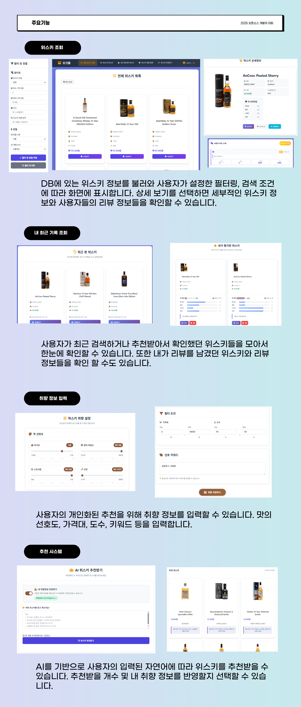

# OakCask
오크통은 위스키 데이터를 기반으로 AI가 사용자의 취향에 맞는 위스키를 추천해주는 개인 맞춤형 웹 애플리케이션입니다.


## Feature


## Architecture


## AI 추천 시스템 

Agentica + OpenAI로 사용자의 복잡한 취향을 이해하고 개인 맞춤형 위스키를 추천합니다.

### 복잡도 분석 알고리즘
AI가 사용자 질문을 받으면 먼저 다음과 같은 기준으로 복잡도를 분석합니다.
- 키워드 2개 이상
- 연결어 사용
- 구체적 수치 표기
- 비교 표현
- 다중 조건
- 복합 맛 표현

판단 예시
- 간단한 질문: "부드러운 위스키 추천해줘"
- 복잡한 질문: "10만원대에서 부드럽고 달콤한 스코틀랜드 위스키 추천해줘"

### **Agentica 모드** (복잡한 조건)
사용자로 부터 복잡한 질문이 들어오면 Agentica 프레임워크를 활용합니다.
- 질문 분해: 복잡한 조건을 개별 요소로 분리
- 순차적 API 호출: 조건별로 데이터베이스상에서 탐색
- 결과 통합: 여러 검색 결과를 지능적으로 조합
- 최적화된 추천: 사용자 조건에 가장 적합한 위스키 최종 선택


### **빠른 모드** (간단한 조건)
스마트 샘플링과 캐시 시스템으로 정확하고 빠른 추천을 제공합니다.
- 스마트 샘플링: 위스키를 가격대별로 균등 선택
- 캐시 시스템: 5분간 유효한 LRU 캐시로 성능 최적화
- 빠른 필터링: 키워드 기반 실시간 필터링
- OpenAI 호출: GPT-4.1-mini를 이용하여 최종 선택
- 결과 보강: 요청 개수 부족 시 추가 추천 제공

## 개발환경 구성

### **요구사항**
- Node.js 18.x 이상
- MongoDB 5.x 이상
- OpenAI API 키

### **환경 설정**
```bash
# 레포지토리 클론
git clone https://github.com/ChangJoEconomy/OakCask.git
cd OakCask

# 의존성 설치
npm install
```

### **환경 변수 설정**
```bash
# .env 파일 생성
DB_CONNECT = mongoDB_connection_string_here
OPENAI_API_KEY = openai_api_key_here
JWT_SECRET = jwt_secret_here
PORT = 3000
```

### **서버 실행**
```bash
# 서버(app.js) 실행
npm start
```